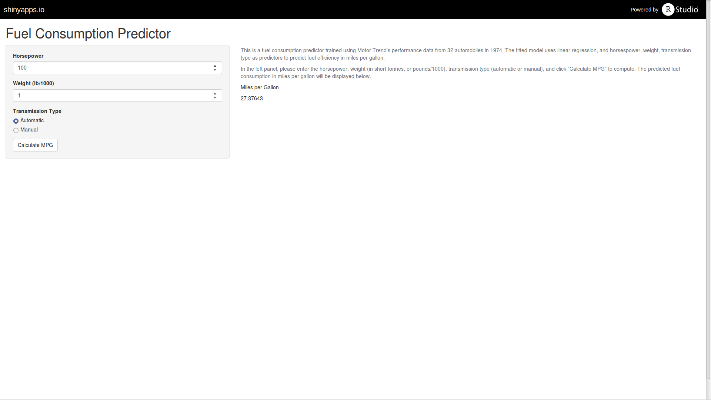

## Automobile Fuel Consumption Predictor

When purchasing an automobile, it would be valuable for consumers to have an independent evaluation of fuel consumption,
in addition to manufacturer's stated figures.

Using the fuel consumption data provided by Motor Trend, I hereby present a predictive model using just three simple predictors:

- Horsepower
- Weight
- Transmission Type

---

## Model Fitting

Using the R caret package, we apply linear regression to Motor Trend's dataset:

```{r echo=F}
library(caret)
```

```{r}
library(datasets)
data(mtcars)

df <- mtcars
df$cyl <- as.factor(df$cyl)
df$am <- as.factor(df$am)
df$gear <- as.factor(df$gear)

fit <- train(mpg ~ hp + wt + am, data=df, method='lm')
```

---

## Explained Variances

Running summary on the fitted model, we see that the 3 predictors combine to explain 83% of the variances:

```{r}
summary(fit)
```

---

## UI Demonstration

Predicting fuel consumption is easy!



---

## Conclusion

Using the predictor, consumers now have an independent, unbiased evaluation of fuel consumption, which can be used when comparing different car models and making purchasing decisions.

https://doctorpacket.shinyapps.io/FuelConsumption

---


